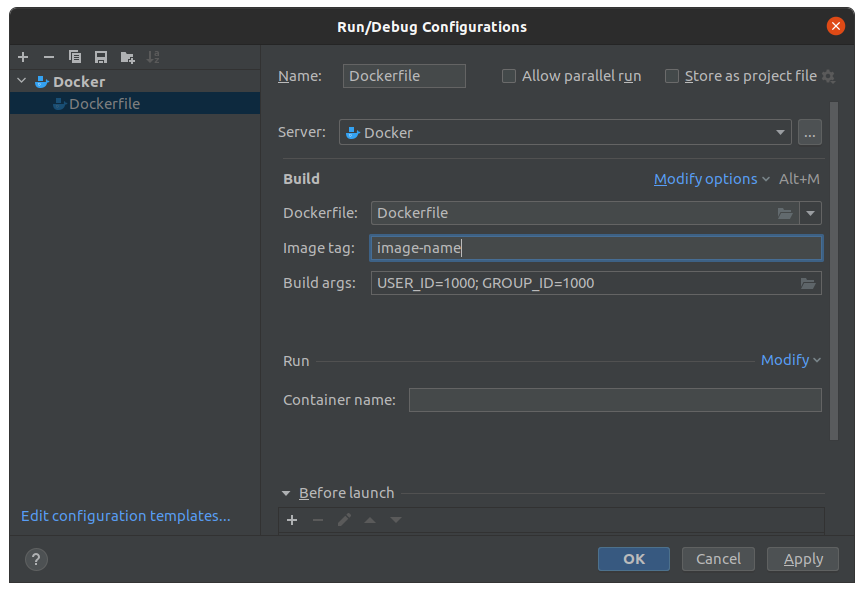

# RazerBladeStealth-eGPU-Ubuntu-Setup
These instructions work for a Razer Blade Stealth 13" (Early 2020, RZ09-0310) with a GTX 1650 Ti iGPU and a RTX 3090 eGPU inside a Razer Core X.
These instructions specifically create my working environment with all necessary software.
Use at your own risk!

## Install and Configure Ubuntu
1. Download and install [Ubuntu 22.04.3 LTS](https://ubuntu.com/download/desktop), which should default to X11 with Nvidia cards.
   - Select "Download updates while installing Ubuntu"
   - Select "Install third-party software for graphics and Wi-Fi hardware and additional media formats"
     - Use Secure Boot option
2. Ensure `nvidia-smi` sees iGPU
3. Disable and blacklist nouveau drivers:
   ```
   sudo bash -c "echo blacklist nouveau > /etc/modprobe.d/blacklist-nvidia-nouveau.conf"
   sudo bash -c "echo options nouveau modeset=0 >> /etc/modprobe.d/blacklist-nvidia-nouveau.conf"
   ```
4. `cat /etc/modprobe.d/blacklist-nvidia-nouveau.conf` should print:
   ```
   blacklist nouveau
   options nouveau modeset=0
   ```
5. Remove noveau:
   ```
   sudo apt purge xserver-xorg-video-nouveau
   sudo apt autoremove
   ```
6. Fix susped loop:
   - `sudo gedit /etc/default/grub`
   - Modify `GRUB_CMDLINE_LINUX_DEFAULT="quiet splash button.lid_init_state=open"`
   - `sudo update-grub`
7. Reboot


## Configure eGPU
Only use eGPU if the eGPU has a monitor attached. Otherwise, the eGPU will be disabled on boot. 

1. Boot laptop unplugged from Razer Core X
2. Power on Razer Core and connect to Thunderbolt 3 port
3. Install and follow instructions from [egpu-switcher](https://github.com/hertg/egpu-switcher)
   - `lspci -nn` will will help associate device IDs with device names
4. Reboot


## Install/Remove Software
1. Remove Thunderbird
   ```
   sudo apt purge thunderbird
   sudo apt autoremove
   ```
3. `sudo apt install libfuse2` enables AppImages to work
4. `sudo apt install texlive-science texlive-pictures texlive-latex-extra`
5. `sudo snap install slack`
6. `sudo snap install pycharm-professional --classic` (still needs classic confinement)
7. `sudo snap isntall zotero-snap`
8. [Zoom](https://support.zoom.us/hc/en-us/articles/204206269-Installing-or-updating-Zoom-on-Linux)
9. [pCloud](https://www.pcloud.com/download-free-online-cloud-file-storage.html)
10. [Bitwarden](https://bitwarden.com/download/)
11. [Station](https://getstation.com/)
12. [Write](https://www.styluslabs.com/)

For AppImages that cannot be added as favorites to the Ubuntu dock:
1. Create `name_of_application.desktop` file
2. `desktop-file-validate name_of_application.desktop`
3. `desktop-file-install --dir=/home/andrew/.local/share/applications path_to_desktop_file/name_of_application.desktop`


## Install Docker with NVIDIA Support
1. Install Docker per [Ubuntu Instructions](https://docs.docker.com/engine/install/ubuntu/#install-using-the-repository)
2. Complete linux [post-implementation steps](https://docs.docker.com/engine/install/linux-postinstall/)
3. Install [NVIDIA Container Toolkit](https://docs.nvidia.com/datacenter/cloud-native/container-toolkit/latest/install-guide.html#)
4. Reboot

## Configure Pycharm for Docker
1. Edit run configuration for Dockerfile args to show: `USER_ID=1000; GROUP_ID=1000`

2. Edit python run configuration template and modify Docker options:

